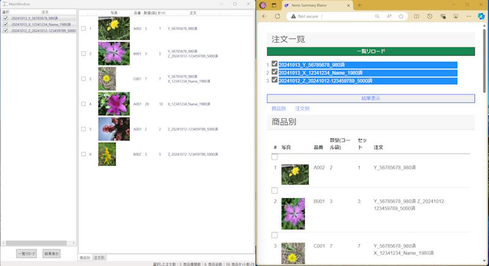

## ItemsSummaryDemo

### 機能
以下の機能を有するシンプルなWPF/Blazorアプリです
- 複数の注文txtファイルに出現する重複する商品の数量を合算し、写真付きで重複しない商品リストを出力する。
- 注文別の商品一覧も表示する

＊注文txtファイルや商品写真は別のアプリが生成したものです。

### 何のために？
当店の商品は単価が安く、ひと注文当たりの商品数が多いです。

出荷のために、複数のお客様からの注文を順番に見ながら倉庫に行って商品を取ってくるとします。

注文１にも注文２も商品Aが存在する場合は、商品Aの棚に２回行って出庫作業をしなければなりませんでした。

商品別に複数注文の数量をまとめることで、1種類の商品＝1回の出庫作業を実現しました。

### 補足説明
- シンプルなアプリですが、練習のために以下を使用：
	- CommunityToolkit.Mvvm
	- Microsoft.Extensions.DependencyInject
- MvvmはWpfともBlazorとも相性がよく、MとVMの部分を共有し、ついでに両方を実装
- Testはもともと不完全ですが、Demoのため一部削除